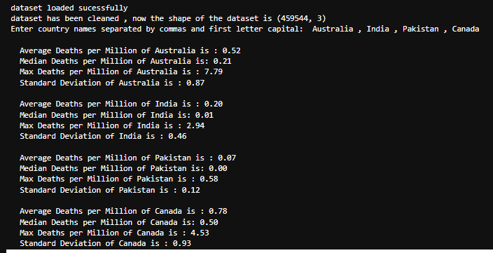
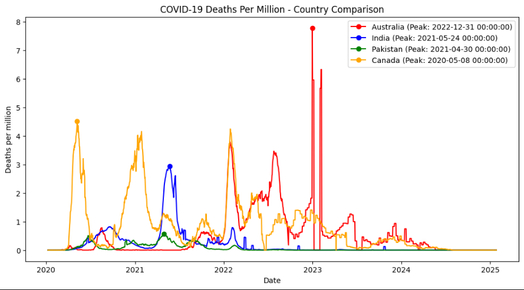
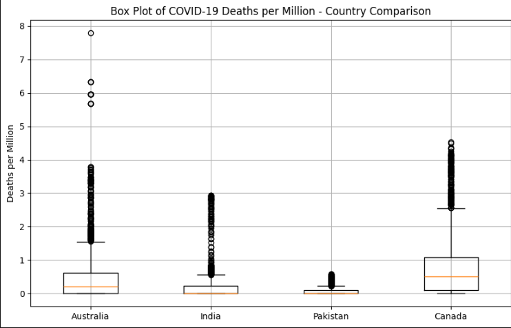

# COVID-19 Deaths Analysis

This project analyzes daily COVID-19 deaths per million people using `Python, Pandas, NumPy, and Matplotlib`. It creates a `time-series plot` showing deaths over time with peak days marked and a box plot for data distribution.

## Features
- Loads and cleans COVID-19 deaths data.
- Calculates `average, median, max, and standard deviation` for selected countries.
- Plots time-series with peak death days and a box plot for comparison.

## Setup
1. Download the dataset `daily-new-confirmed-covid-19-deaths-per-million-people.csv` from [Our World in Data](https://github.com/owid/covid-19-data/tree/master/public/data) and place it in the same folder as `covid_deaths_analysis.ipynb`.
2. Install dependencies: `pip install -r requirements.txt`
3. Run the notebook in Jupyter: `jupyter notebook covid.ipynb`
4. Enter country names (e.g., "United States, Canada") when prompted.

## Screenshots
- Console Output  
  
- Time-Series Plot  
  
- Box Plot  
